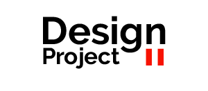
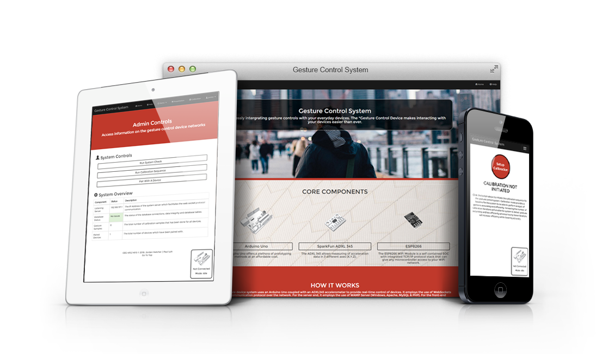

## 

##

# DesignProject II (Gesture Control System)

## Installation
To install the gesture control system web application on your desktop

1. `git clone https://github.com/ploh007/design-project.git projectname`
2. `cd projectname`
3. `cd webInterface`
3. `composer install`
4. `php artisan key:generate`
5. Create a database and inform .env file
6. `php artisan migrate --seed`
7. `php artisan serve`

## Built Using
* [Laravel](https://laravel.com/) - A PHP Web Application Framework
* [Bootstrap](http://getbootstrap.com/) - A Front-End Development Framework
* [jQuery](https://jquery.com/) - A Java Script Framework

## Feature List
* Home Page
* Basic Authentication & Registration
* Web Sockets for transmitting data across the gesture control device and the web application
* Custom status code to identify states of the gesture control device
	* Calibration Mode
	* User Mode
	* Raw Mode 
* Help Documentation
* Simple Apps
	* Graph Controller
	* 2048 Integration
	* Gesture Notifier
	* HexGL Integration
	* Globe Controller
* Technology Presentation
* Custom Calibration Settings

## To-do
* Better pattern recognition to identify types of gestures performed by the user
* Advanced gesture calibration settings
* Device Pool Functionality
* Update help information

## Developed by
Jordan Hatcher && [Paul Loh](http://www.paulloh.com)

## Project License
MIT License
